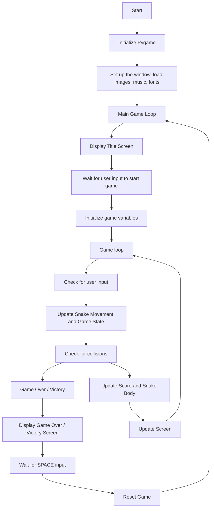

# Welcome

Created by Andrew Westphal and Abdullah Malik

Welcome to the repository of our game Snake, based of of Google's Snake. In this game, you start as a snake head and you must use the arrow keys to controll the direction of the snake. Your objective is to collect apples to increased your score, but each time you eat an apple, the length of your snake grows. If you run into yourself or the border of the game, you lose. If you are able to fill the map and reach a score of 99, you win!!!

Enjoy!!!

# How to run

## Downloads:

* Game Files (Code, Download zip)
* Python (Open Windows Powershell, enter: pip install python)
* Pygame (Open Windows Powershell, enter: pip install pygame)

## How to run:

### With code editor (VS Code):

* Unzip file
* Run code in editor (Ctrl f5)

### With command terminal (Windows Powershell / Gitbash):

Enter commands:
* cd .\Downloads\finalgame\
* python .\game_files\main.py

# Our greatest accomplishments as a team:

* Controlls: The player is able to queue multiple moves at once, allowing for cleaner controll of the snake. Each time the snake moves, the snakes next move is based off of the next value in the queue. If nothing is queued, the snake countinues in the same direction.
* Animation: The entire snake smoothly glides across the screen at 1px every frame. The snake's head cycles through 24 frames at 30 fps, making the snake appear as if it were alive. The snake has additional graphics for the gameover screen.
* Snake body: Each body part of the snake is stored in coordinate and direction arrays. These arrays are constanly updated so each body of the snake moves to the correct position. This allows the snake's body to appear animated and glide behind the head.

# Flowchart

